**explosion** creates a movie of the exploded view of a molecule.
If there are multiple objects given for explosion, first they get spatially
separated and then explode individually one after the other. The order of
explosion is the order of given list of objects.

There are two types of explosion direction:

* **'com'** (default): 	the centers of mass (com) of the chains of the object to be tranlated and the object are calulated and the single chains are translated along a vector through the chain's com and 	object's com.
* **'canonical'**: the dimensions of a box around the object are used to select the two longest edges and so the axes to translate along in a consistent distance

If only a part of the object shall be translated the object can be given as
complex to make sure the part is not translated into the object.

### DEPENDENCIES:

[get_colors.py](https://pymolwiki.org/index.php/Get_colors),
[center_of_mass.py](https://pymolwiki.org/index.php/Center_of_mass),
[viewpoints.py](https://github.com/julianheinrich/viewpoints)
in the modules of PyMOL.

### USAGE:

explosion selected [,typeOfExplosion [,complex [,removeSolvents [,exclude [, cutoff [,colorBinding [, showlabels]]]]]]]

### ARGUMENTS:
- selected: 	names of objects to explode
- typeOfExplosion: 	'com'(default) or 'canonical'
- complex:	Name of object relative to the part of molecule which shall be translated
- removeSolvents: boolean (default: True), removes all solvents and ligands with occurance bigger than cutoff value
- exclude: 3-letter code of ligand which shall not be removed (if occurance is known to be bigger than cutoff)
- cutoff: default: 10, occurance in PDB in total
- colorBinding:
 - chain: each chain has an individual color, binding sites are colored by the colors of according chains
 - contact (default): all chains are colored gray, each binding site is colored individually
 - none: no color is changed
- showlabels: default: False, if set True, labels are shown in the whole movie, else only in beginning and end

### EXAMPLES:
```python
	# run explosion_movie.py
	run explosion_movie.py
```

```python
	reinitialize
	# load molecule in PyMOL:
	fetch 3oaa, type='pdb1'
	# either explode complete molecule:
	explosion 3oaa, colorBinding = chain, exclude = ADP ANP
```


```python
	# or parts of it:
	reinitialize
	fetch 3oaa, type='pdb1'
	extract AA, chain A chain B chain C chain D chain E chain F
	extract BB, chain G chain H
	explosion AA BB, exclude = ADP ANP
```
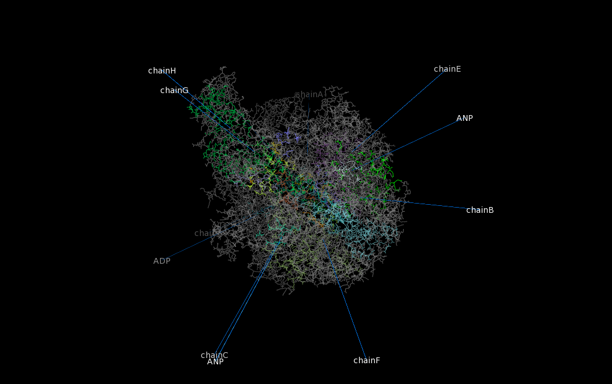

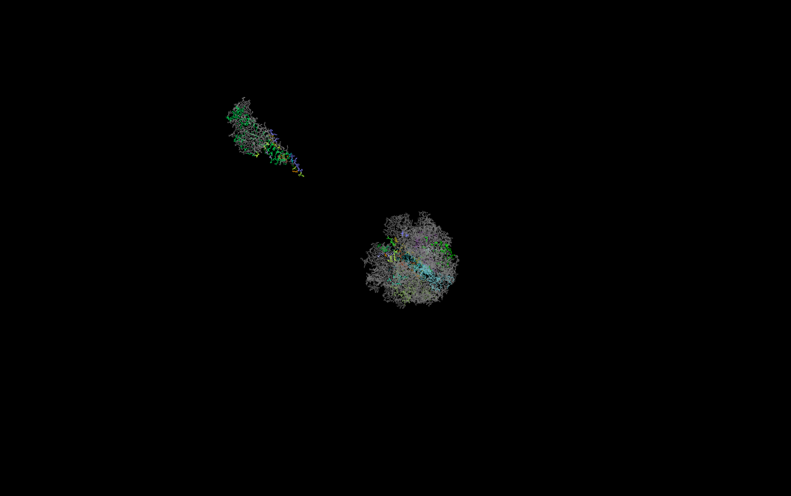

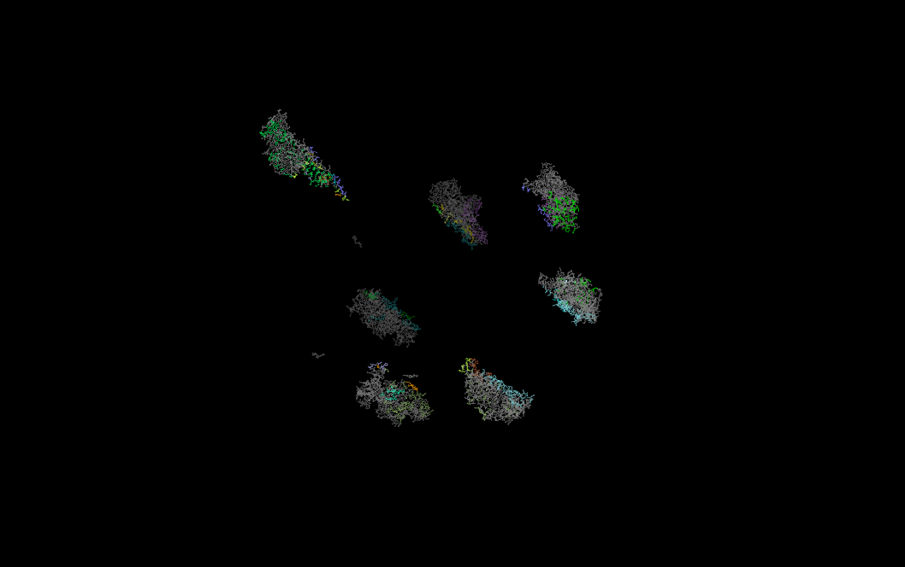

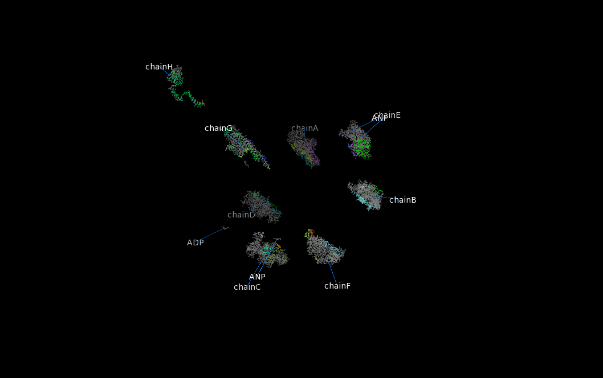

```python
	# or explode canonical without and canonical:
	explosion 3oaa, typeOfExplosion = canonical, colorBinding = none, exclude ADP ANP
```
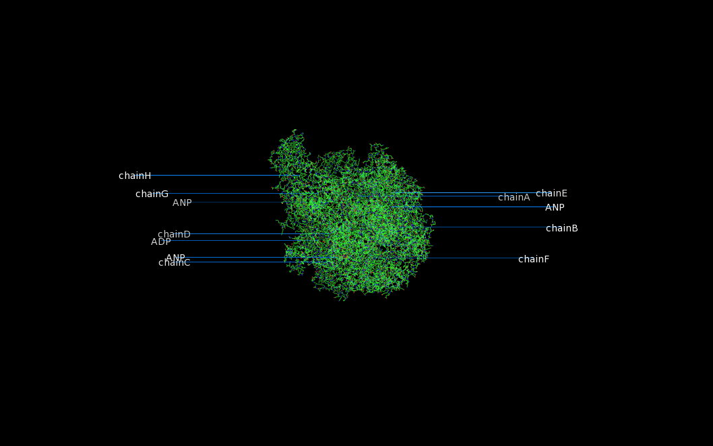

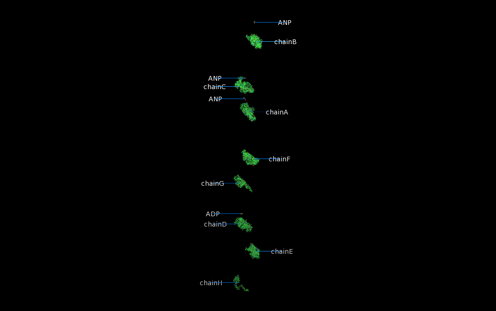

```python
  reinitialize
	# load multiple symmetry operators
	fetch 3oaa

	# case sensitive for chain identifiers
	cmd.set('ignore_case', 'off')

	# create object for every symmetry unit
	extract mol1, chain A chain B chain  C chain D chain  E chain F chain G chain  H
	extract mol2, chain I chain J chain  K chain L chain  M chain N chain O chain  P
	extract mol3, chain Q chain R chain  S chain T chain  U chain V chain W chain  X
	extract mol4, chain Y chain Z chain  a chain b chain  c chain d chain e chain  f

	explosion mol1 mol2 mol3 mol4, colorBinding = chain
```
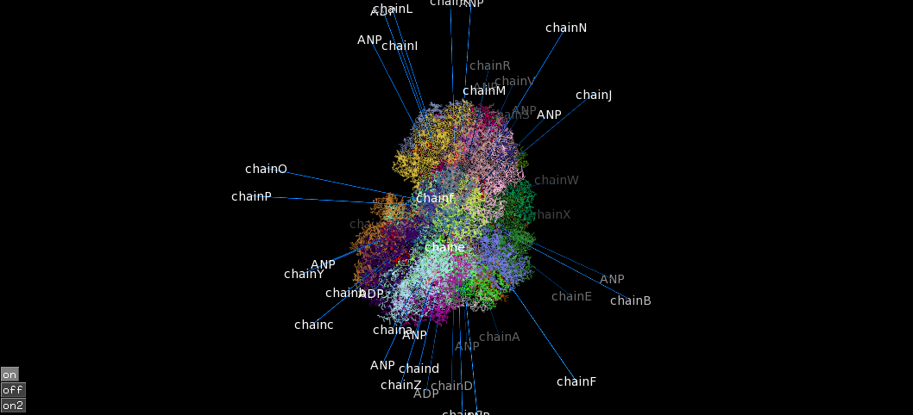

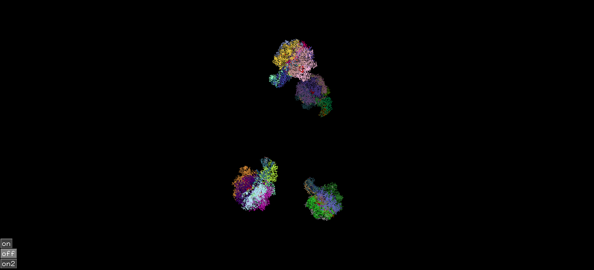


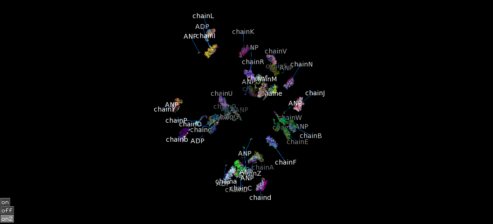

```python
    reinitialize
	# portein with multiple states:
	fetch 5k7l, type=pdb1

	# create object for every state
	split_states 5k7l
    remove 5k7l
    explosion 5k7l_0001 5k7l_0002 5k7l_0003 5k7l_0004
```
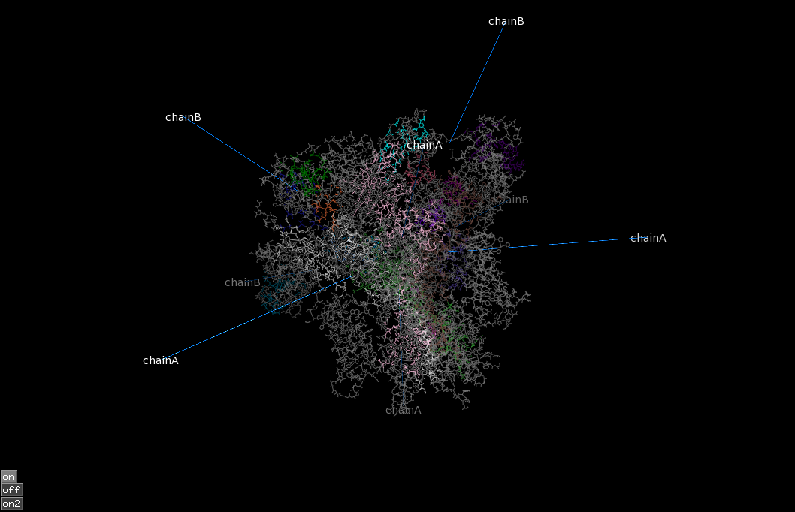

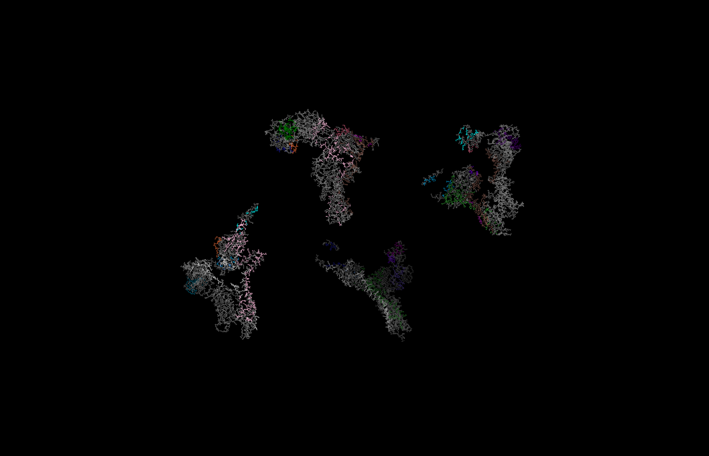

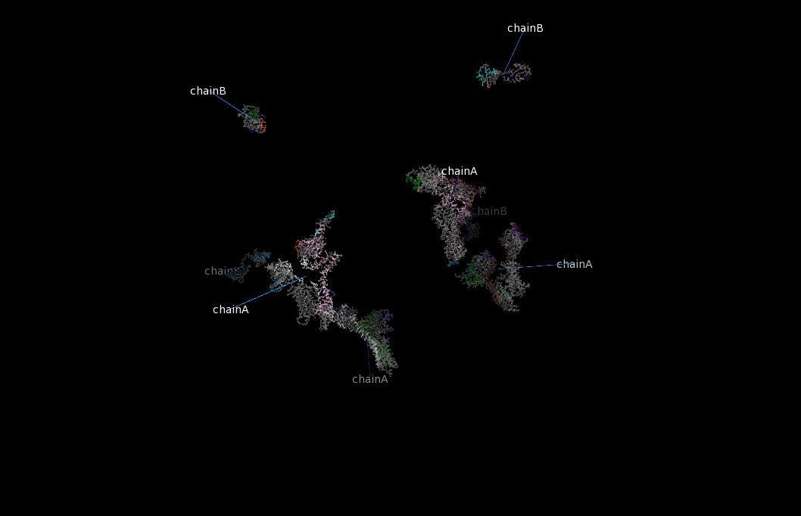

```python
	# load molecule
	fetch 3oaa, type = pdb1

	# create object for part or molecule
	create chainA, chain A

	explosion chainA, complex = 3oaa
```


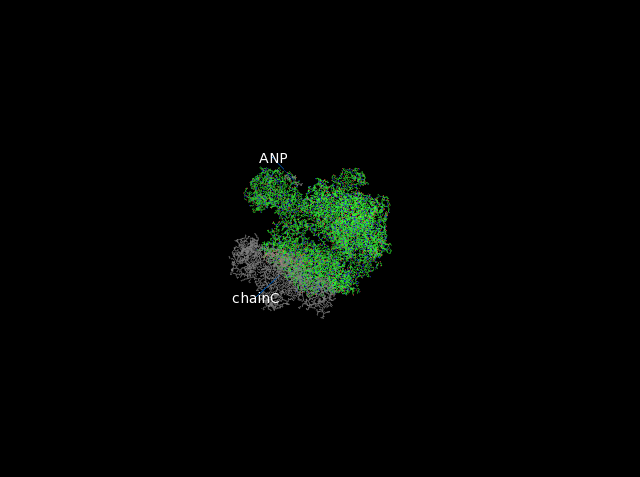
