**explosion** creates a movie of the exploded view of a molecule.
If there are multiple objects given for explosion, first they get spatially
separated and then explode individually one after the other. The order of
explosion is the order of given list of objects.
There are two types of explosion direction:
- **'com'** (default): 	the centers of mass (com) of the chains of the object to be tranlated and the object are calulated and the single chains are translated along a vector through the chain's com and 	object's com.
- **'canonical'**:		the dimensions of a box around the object are used to select the two longest edges and so the axes to translate along in a consistent distance

If only a part of the object shall be translated the object can be given as
complex to make sure the part is not translated into the object.

###DEPENDENCIES:

[get_colors.py](https://pymolwiki.org/index.php/Get_colors),
[center_of_mass.py](https://pymolwiki.org/index.php/Center_of_mass),
[viewpoints.py](https://github.com/julianheinrich/viewpoints)
in the modules of PyMOL.

###USAGE:
explosion(list of objects, [type of explosion [,complex]])

###ARGUMENTS:
- list of objects: 	list of strings 	Objects' names to explode
- type of explosion: 	string 				'com'(default) or 'canonical'
- complex:			string				Name of object relative to the part of molecule which shall be translated


###EXAMPLES:
```python
	# run explosion_movie.py
	run explosion_movie.py
```
```python
	# load molecule in PyMOL:
	fetch 3oaa, type='pdb1'

	# run explosion_movie.py from absolute directory:
	run C:/.../explosion_movie.py

	# either explode complete molecule:
	explosion(['3oaa'])
	```
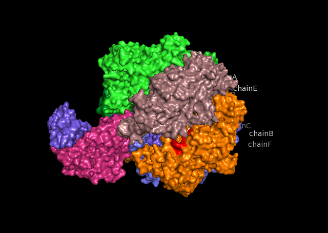

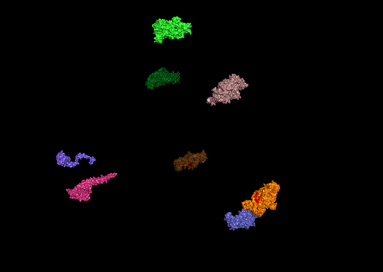

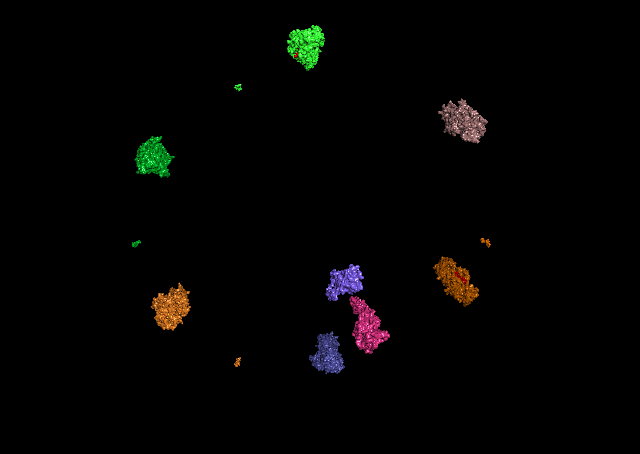

```python
	# or parts of it:
	create ABCDEF, chain A chain B chain C chain D chain E chain F
	create GH, chain G chain H
	explosion(['ABCDEF','GH'])
```
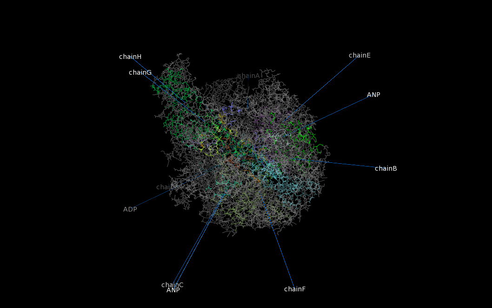

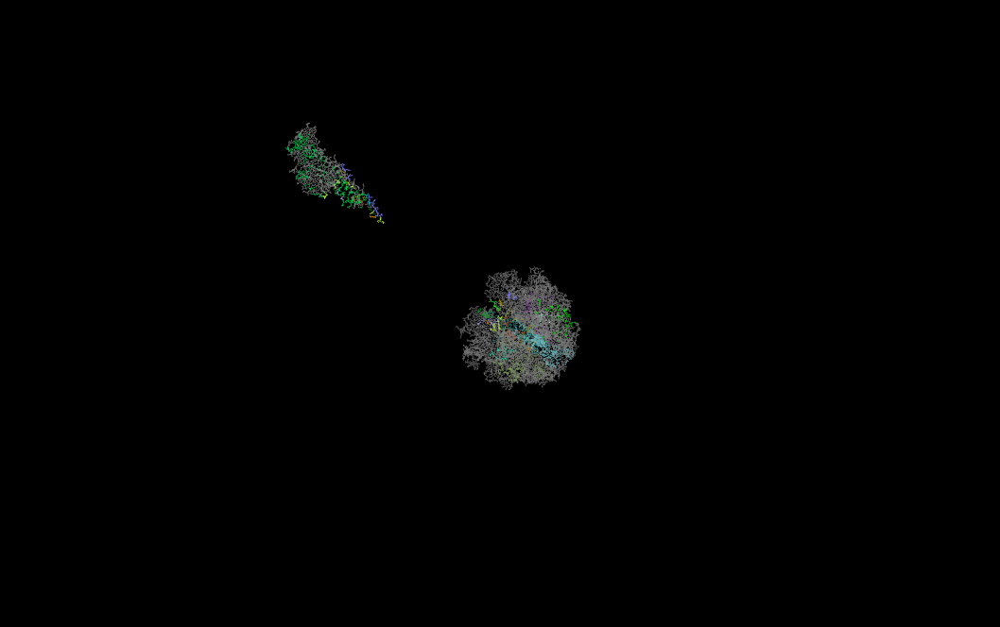

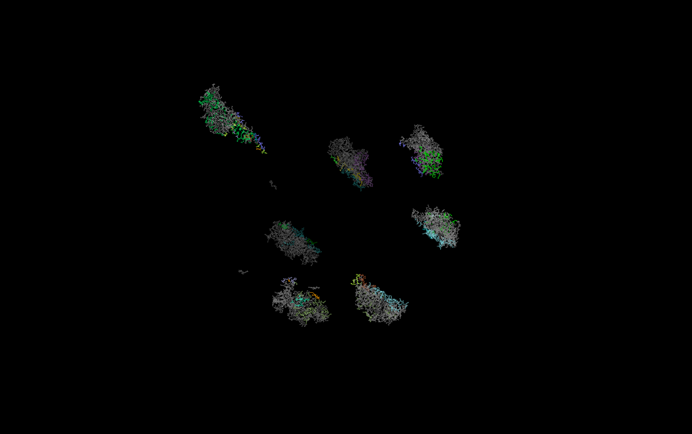

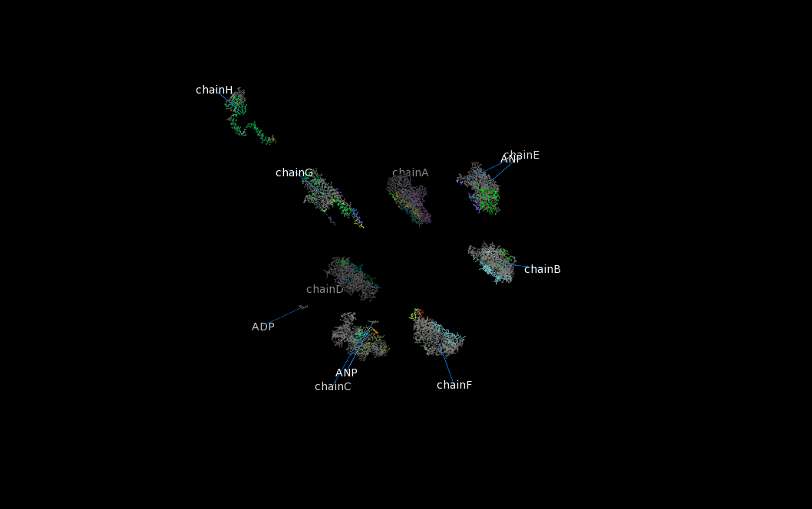
```python
	# or explode canonical:
	explosion(['3oaa'], 'canonical')
```
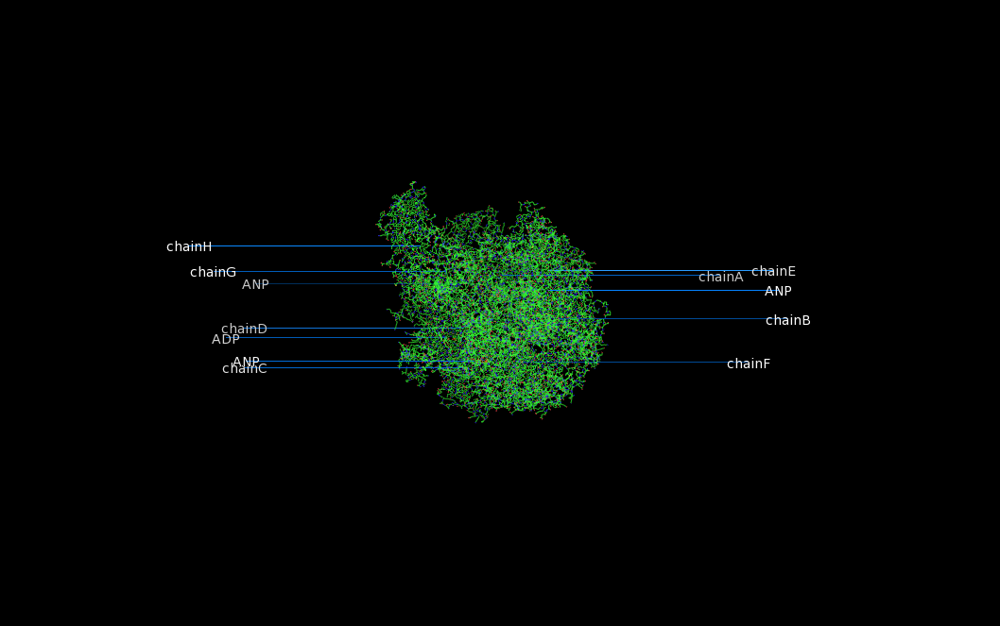

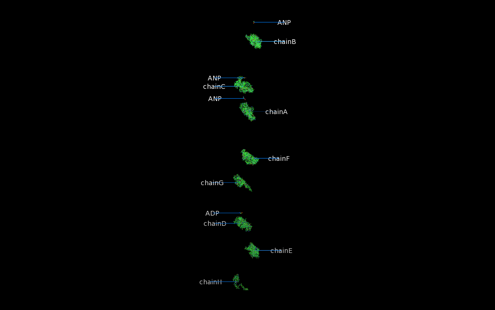

```python
	# load multiple symmetry operators
	fetch 3oaa

	# case sensitive for chain identifiers
	cmd.set('ignore_case', 'off')

	# create object for every symmetry unit
	create mol1, chain A chain B chain  C chain D chain  E chain F chain G chain  H
	create mol2, chain I chain J chain  K chain L chain  M chain N chain O chain  P
	create mol3, chain Q chain R chain  S chain T chain  U chain V chain W chain  X
	create mol4, chain Y chain Z chain  a chain b chain  c chain d chain e chain  f

	explosion(['mol1', 'mol2', 'mol3', 'mol4'])
```
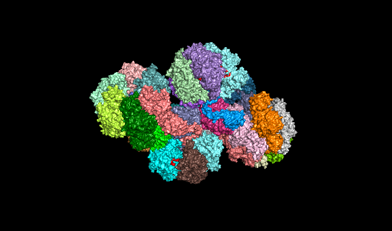

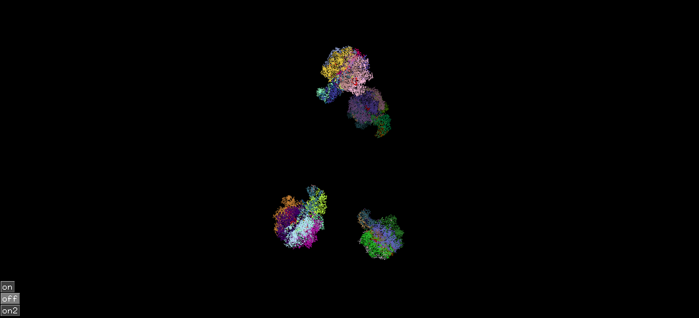

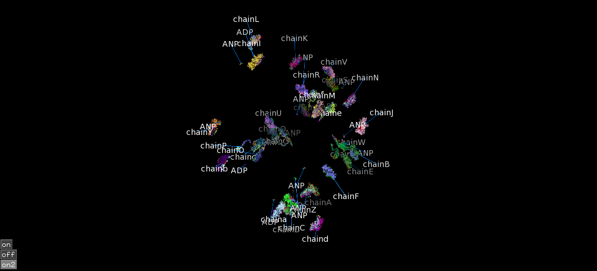

```python
	# portein with multiple states:
	fetch 5k7l, type=pdb1

	# create object for every state
	split_states 5k7l

	explosion(['5k7l_0001', '5k7l_0002', '5k7l_0003', '5k7l_0004'])
```
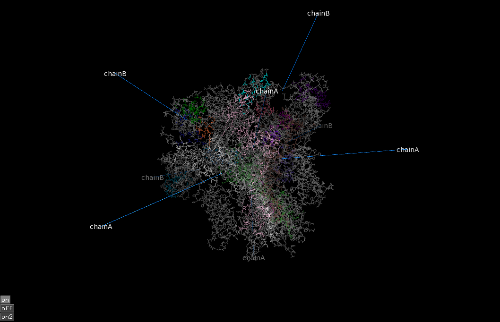

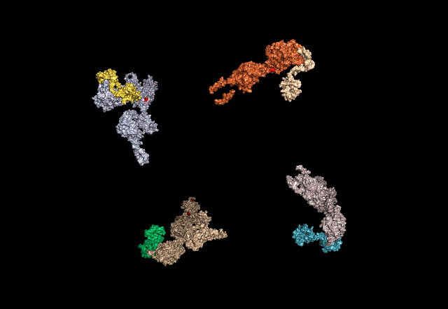

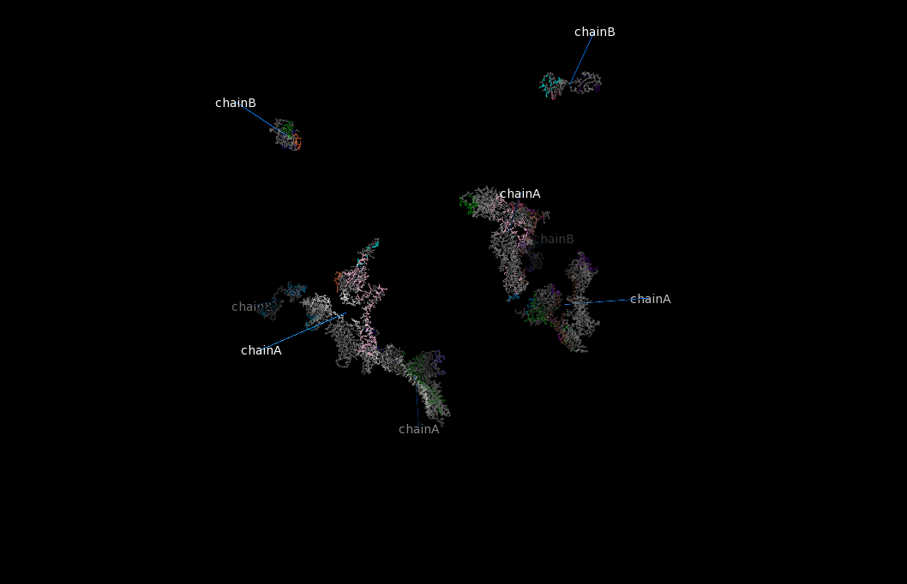

```python
	# load molecule
	fetch 3oaa, type = pdb1

	# create object for part or molecule
	extract chainA, chain A

	explosion(['chainA'], 'com', '3oaa')
```
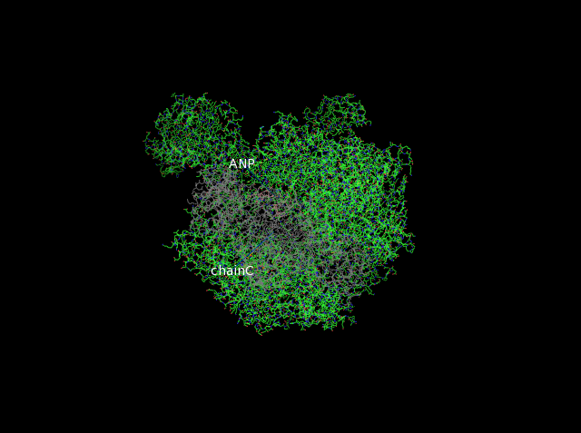

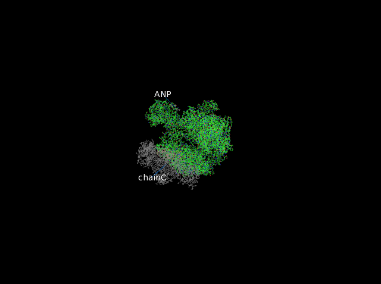
